# generativeart

[](https://github.com/jdxyw/generativeart/actions/workflows/go.yml)
[](https://goreportcard.com/report/github.com/jdxyw/generativeart)
[](https://raw.githubusercontent.com/jdxyw/generativeart/master/LICENSE)

`generativeart` is a `Go` package to generate many kinds of generative art. The goal is to collect some excellent generative art (implemented in `R` or `Processing`), and rewrite them in `Go` again. I would paste the original link at the end of this README(If I remember, you can also submit a PR if you found I missed something.). Currently, it supports the following type.

# Table of Contents

- [generativeart](#generativeart)
- [Table of Contents](#table-of-contents)
  - [Buy me a coffee](#buy-me-a-coffee)
  - [Types supported](#types-supported)
  - [Install](#install)
  - [Art Type](#art-type)
  - [Docs](#docs)
  - [Examples](#examples)
  - [General Options](#general-options)
  - [Usage and example](#usage-and-example)
    - [Junas](#junas)
    - [Random Shapes](#random-shapes)
    - [Color Circle2](#color-circle2)
    - [Circle Grid](#circle-grid)
    - [Circle Composes Circle](#circle-composes-circle)
    - [Pixel Hole](#pixel-hole)
    - [Dots Wave](#dots-wave)
    - [Contour Line](#contour-line)
    - [Noise Line](#noise-line)
    - [Dot Line](#dot-line)
    - [Ocean Fish](#ocean-fish)
    - [Circle Loop](#circle-loop)
    - [Circle Noise](#circle-noise)
    - [Julia Set](#julia-set)
    - [Black Hole](#black-hole)
    - [Silk Sky](#silk-sky)
    - [Circle Move](#circle-move)
    - [Random Circle](#random-circle)
  - [TODO](#todo)
  - [Contribution](#contribution)

## Buy me a coffee

If you found this package is useful, maybe you could buy me a coffee from [Paypal](https://www.paypal.me/jdxyw).

## Types supported

This package is still working in progress. More types would be added. Welcome anyone interested in this field to submit your PR.

- Maze
- Julia Set
- Random Circle Trails
- Silk Smoke
- Spiral Square
- Square Grid
- Circle Line
- Circle Loop
- Silk Sky
- Dot Line
- Swirl
- Point Ribbon
- Janus
- Random Shapes
- Color Circle
- Color Circle2
- Circle Grid
- Contour Line
- Noise Line
- Ocean Fish
- Circle Loop2
- Pixel Hole
- Dots Wave
- Circle Move
- Circle Noise
- Yarn
- Black Hole

For these kinds of art, the package provides as many parameters to control the appearance.

## Install

The go version I used is `Go 1.16`.

```bash
go get github.com/jdxyw/generativeart
```

## Art Type

```go
NewCircleLine(step float64, lineNum int, radius, xaixs, yaixs float64)
NewCircleLoop(radius float64)
NewMaze(step int)
NewRandCicle(mc, msp int, minStep, maxStep, minr, maxr float64, isRandColor bool)
NewSilkSky(circleNum int, sunRadius float64)
NewSilkSmoke(mc, msp int, minStep, maxStep, minRadius, maxRadius float64, isRandColor bool)
NewSpiralSquare(squareNum int, rectSide, decay float64, randColor bool)
NewSwirl(a, b, c, d, xaixs, yaixs float64)
NewDotLine(n int, ras, canv float64, randColor bool)
NewPointRibbon(r float64)
NewJanus(n int, decay float64)
NewRandomShape(shapeNum int)
NewColorCircle(circleNum int)
NewColorCircle2(circleNum int)
NewCircleGrid(circleNumMin, circleNumMax int)
NewContourLine(lineNum int)
NewNoiseLine(n int)
NewCircleLoop2(depth int)
NewPixelHole(dotN int)
NewDotsWave(dotsN int)
NewCircleMove(circleNum int)
NewCircleNoise(dotsN, colorMin, colorMax int)
NewYarn(n int)
NewBlackHole(circleN int, density, circleGap float64)
```

## Docs

You could find the docs in the [doc](./docs).

## Examples

You could find examples for all types under [example](./example).

## General Options

```go
type Options struct {
 background  color.RGBA
 foreground  color.RGBA
 lineColor   color.RGBA
 lineWidth   float64
 colorSchema []color.RGBA
 nIters      int
 alpha       int
}
```

The `Options` is a global option for the whole `canva`. It includes those general parameters used by different kinds of types, such as `background`, `lineColor`, and `colorScheme`.

For those parameters specified for different kinds of art types, they have their own `struct`.

## Usage and example

Below are some selective examples. For more examples, you could check the example folder.

### Junas

```go
func main() {
 rand.Seed(time.Now().Unix())
 c := generativeart.NewCanva(500, 500)
 c.SetBackground(common.Black)
 c.FillBackground()
 c.SetColorSchema(common.DarkRed)
 c.SetForeground(common.LightPink)
 c.Draw(arts.NewJanus(10, 0.2))
 c.ToPNG("janus.png")
}
```

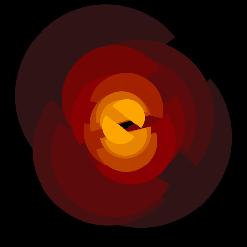

### Random Shapes

```go
func main() {
 rand.Seed(time.Now().Unix())
 c := generativeart.NewCanva(500, 500)
 c.SetBackground(common.White)
 c.FillBackground()
 c.SetColorSchema([]color.RGBA{
  {0xCF, 0x2B, 0x34, 0xFF},
  {0xF0, 0x8F, 0x46, 0xFF},
  {0xF0, 0xC1, 0x29, 0xFF},
  {0x19, 0x6E, 0x94, 0xFF},
  {0x35, 0x3A, 0x57, 0xFF},
 })
 c.Draw(arts.NewRandomShape(150))
 c.ToPNG("randomshape.png")
}
```


### Color Circle2

```go
func main() {
 rand.Seed(time.Now().Unix())
 colors := []color.RGBA{
  {0x11, 0x60, 0xC6, 0xFF},
  {0xFD, 0xD9, 0x00, 0xFF},
  {0xF5, 0xB4, 0xF8, 0xFF},
  {0xEF, 0x13, 0x55, 0xFF},
  {0xF4, 0x9F, 0x0A, 0xFF},
 }
 c := generativeart.NewCanva(800, 800)
 c.SetBackground(common.White)
 c.FillBackground()
 c.SetColorSchema(colors)
 c.Draw(arts.NewColorCircle2(30))
 c.ToPNG("colorcircle2.png")
}
```

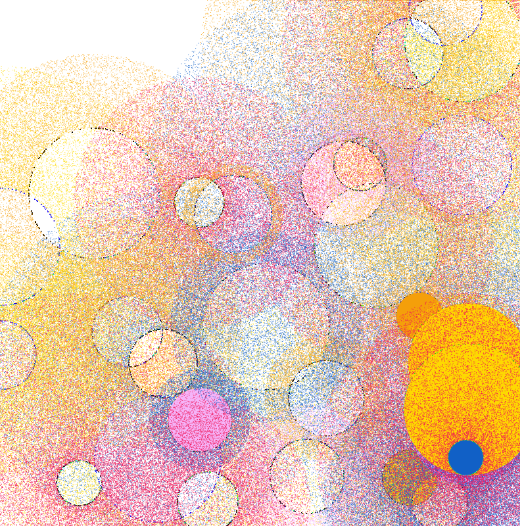

### Circle Grid

```go
func main() {
 rand.Seed(time.Now().Unix())
 colors := []color.RGBA{
  {0xED, 0x34, 0x41, 0xFF},
  {0xFF, 0xD6, 0x30, 0xFF},
  {0x32, 0x9F, 0xE3, 0xFF},
  {0x15, 0x42, 0x96, 0xFF},
  {0x00, 0x00, 0x00, 0xFF},
  {0xFF, 0xFF, 0xFF, 0xFF},
 }
 c := generativeart.NewCanva(500, 500)
 c.SetBackground(color.RGBA{0xDF, 0xEB, 0xF5, 0xFF})
 c.FillBackground()
 c.SetColorSchema(colors)
 c.SetLineWidth(2.0)
 c.Draw(arts.NewCircleGrid(4, 6))
 c.ToPNG("circlegrid.png")
}
```

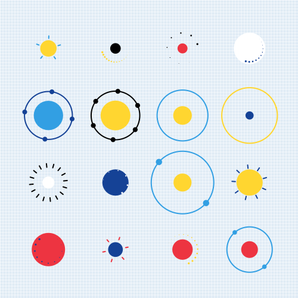

### Circle Composes Circle

```go
func main() {
 rand.Seed(time.Now().Unix())
 colors := []color.RGBA{
  {0xF9, 0xC8, 0x0E, 0xFF},
  {0xF8, 0x66, 0x24, 0xFF},
  {0xEA, 0x35, 0x46, 0xFF},
  {0x66, 0x2E, 0x9B, 0xFF},
  {0x43, 0xBC, 0xCD, 0xFF},
 }
 c := generativeart.NewCanva(500, 500)
 c.SetBackground(color.RGBA{8, 10, 20, 255})
 c.FillBackground()
 c.SetColorSchema(colors)
 c.Draw(arts.NewCircleLoop2(7))
 c.ToPNG("colorloop2.png")
}
```

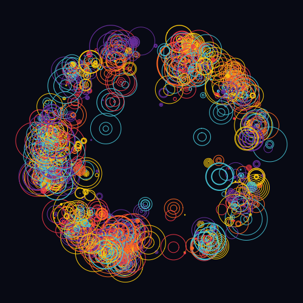

### Pixel Hole

```go
func main() {
 rand.Seed(time.Now().Unix())
 colors := []color.RGBA{
  {0xF9, 0xC8, 0x0E, 0xFF},
  {0xF8, 0x66, 0x24, 0xFF},
  {0xEA, 0x35, 0x46, 0xFF},
  {0x66, 0x2E, 0x9B, 0xFF},
  {0x43, 0xBC, 0xCD, 0xFF},
 }
 c := generativeart.NewCanva(800, 800)
 c.SetBackground(common.Black)
 c.FillBackground()
 c.SetColorSchema(colors)
 c.SetIterations(1200)
 c.Draw(arts.NewPixelHole(60))
 c.ToPNG("pixelhole.png")

}
```

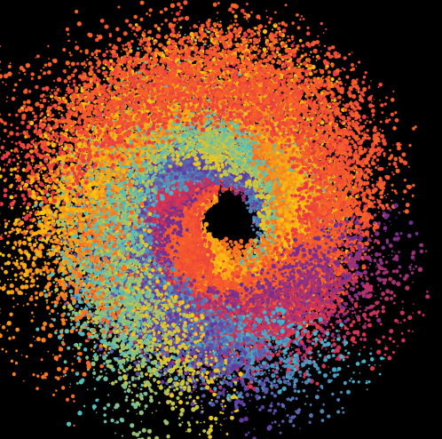

### Dots Wave

```go
func main() {
 rand.Seed(time.Now().Unix())
 colors := []color.RGBA{
  {0xFF, 0xBE, 0x0B, 0xFF},
  {0xFB, 0x56, 0x07, 0xFF},
  {0xFF, 0x00, 0x6E, 0xFF},
  {0x83, 0x38, 0xEC, 0xFF},
  {0x3A, 0x86, 0xFF, 0xFF},
 }
 c := generativeart.NewCanva(500, 500)
 c.SetBackground(common.Black)
 c.FillBackground()
 c.SetColorSchema(colors)
 c.Draw(arts.NewDotsWave(300))
 c.ToPNG("dotswave.png")
}
```

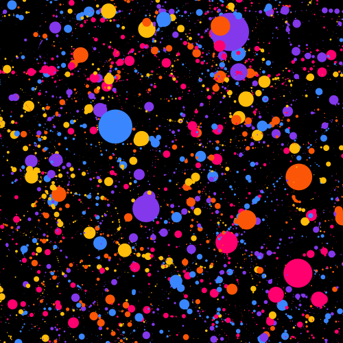

### Contour Line

```go
func main() {
 rand.Seed(time.Now().Unix())
 colors := []color.RGBA{
  {0x58, 0x18, 0x45, 0xFF},
  {0x90, 0x0C, 0x3F, 0xFF},
  {0xC7, 0x00, 0x39, 0xFF},
  {0xFF, 0x57, 0x33, 0xFF},
  {0xFF, 0xC3, 0x0F, 0xFF},
 }
 c := generativeart.NewCanva(1600, 1600)
 c.SetBackground(color.RGBA{0x1a, 0x06, 0x33, 0xFF})
 c.FillBackground()
 c.SetColorSchema(colors)
 c.Draw(arts.NewContourLine(500))
 c.ToPNG("contourline.png")
}
```

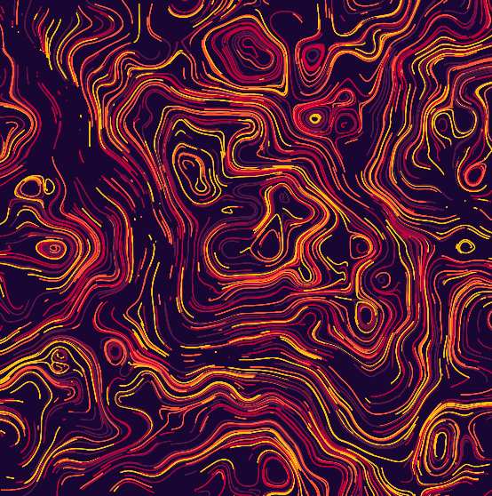

### Noise Line

```go
func main() {
 rand.Seed(time.Now().Unix())
 colors := []color.RGBA{
  {0x06, 0x7B, 0xC2, 0xFF},
  {0x84, 0xBC, 0xDA, 0xFF},
  {0xEC, 0xC3, 0x0B, 0xFF},
  {0xF3, 0x77, 0x48, 0xFF},
  {0xD5, 0x60, 0x62, 0xFF},
 }
 c := generativeart.NewCanva(1000, 1000)
 c.SetBackground(color.RGBA{0xF0, 0xFE, 0xFF, 0xFF})
 c.FillBackground()
 c.SetColorSchema(colors)
 c.Draw(arts.NewNoiseLine(1000))
 c.ToPNG("noiseline.png")
}
```

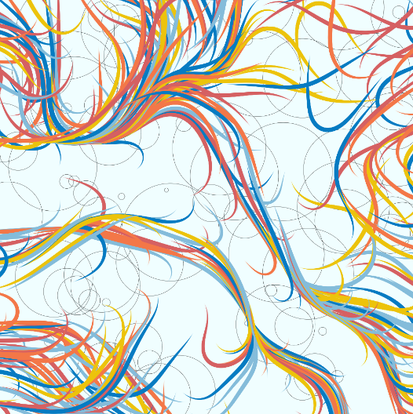

### Dot Line

```go
func main() {
 rand.Seed(time.Now().Unix())
 c := generativeart.NewCanva(2080, 2080)
 c.SetBackground(color.RGBA{230, 230, 230, 255})
 c.SetLineWidth(10)
 c.SetIterations(15000)
 c.SetColorSchema(common.Plasma)
 c.FillBackground()
 c.Draw(arts.NewDotLine(100, 20, 50, false))
 c.ToPNG("dotline.png")
}
```

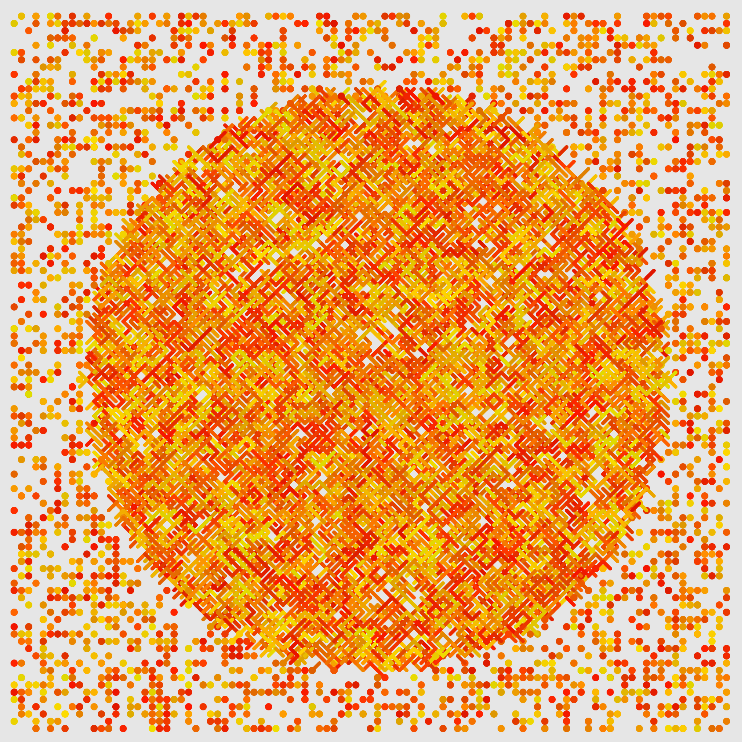

### Ocean Fish

```go
func main() {
 rand.Seed(time.Now().Unix())
 colors := []color.RGBA{
  {0xCF, 0x2B, 0x34, 0xFF},
  {0xF0, 0x8F, 0x46, 0xFF},
  {0xF0, 0xC1, 0x29, 0xFF},
  {0x19, 0x6E, 0x94, 0xFF},
  {0x35, 0x3A, 0x57, 0xFF},
 }
 c := generativeart.NewCanva(500, 500)
 c.SetColorSchema(colors)
 c.Draw(arts.NewOceanFish(100, 8))
 c.ToPNG("oceanfish.png")
}
```

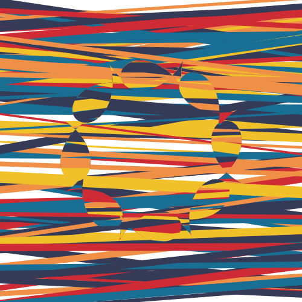

### Circle Loop

```go
func main() {
 rand.Seed(time.Now().Unix())
 c := generativeart.NewCanva(500, 500)
 c.SetBackground(common.Black)
 c.SetLineWidth(1)
 c.SetLineColor(common.Orange)
 c.SetAlpha(30)
 c.SetIterations(1000)
 c.FillBackground()
 c.Draw(arts.NewCircleLoop(100))
 c.ToPNG("circleloop.png")
}
```

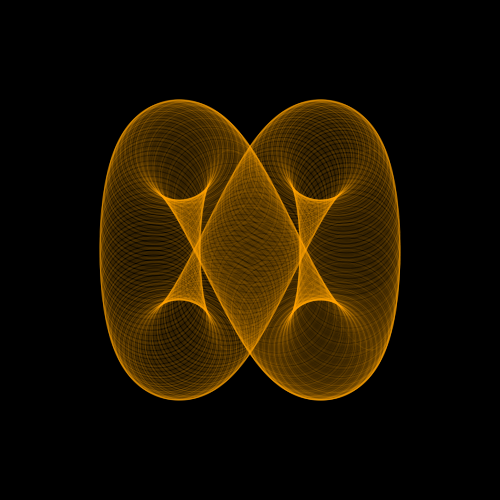

### Circle Noise

```go
func main() {
 rand.Seed(time.Now().Unix())
 c := generativeart.NewCanva(500, 500)
 c.SetBackground(common.White)
 c.SetAlpha(80)
 c.SetLineWidth(0.3)
 c.FillBackground()
 c.SetIterations(400)
 c.Draw(arts.NewCircleNoise(2000, 60, 80))
 c.ToPNG("circlenoise.png")
}
```

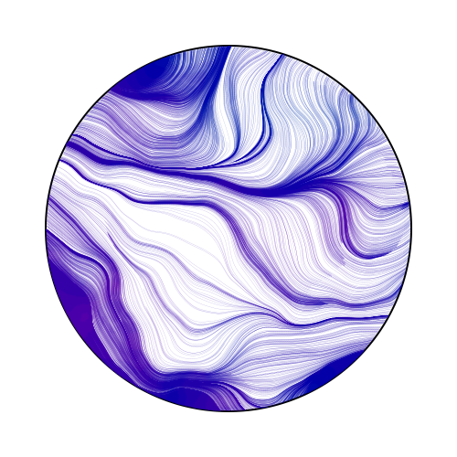

### Julia Set

```go
func julia1(z complex128) complex128 {
 c := complex(-0.1, 0.651)

 z = z*z + c

 return z
}

func main() {
 rand.Seed(time.Now().Unix())
 c := generativeart.NewCanva(500, 500)
 c.SetIterations(800)
 c.SetColorSchema(common.Viridis)
 c.FillBackground()
 c.Draw(arts.NewJulia(julia1, 40, 1.5, 1.5))
 c.ToPNG("julia.png")
}
```

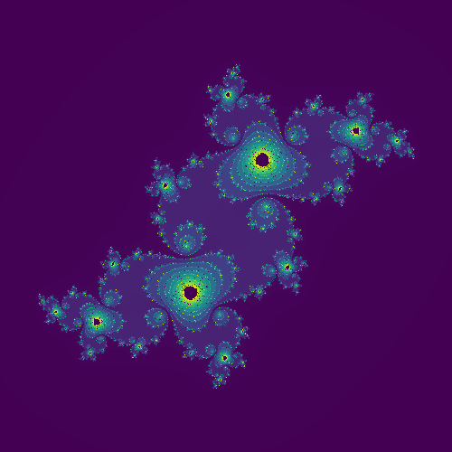

### Black Hole

```go
func main() {
 rand.Seed(time.Now().Unix())
 c := generativeart.NewCanva(500, 500)
 c.SetBackground(color.RGBA{R: 30, G: 30, B: 30, A: 255})
 c.FillBackground()
 c.SetLineWidth(1.0)
 c.SetLineColor(common.Tomato)
 c.Draw(arts.NewBlackHole(200, 400, 0.01))
 c.ToPNG("blackhole.png")
}
```

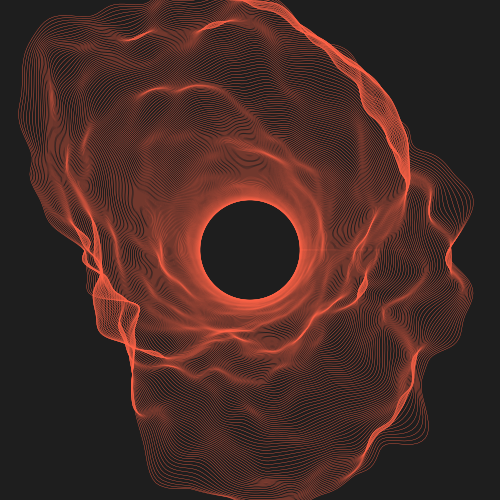

### Silk Sky

```go
func main() {
 rand.Seed(time.Now().Unix())
 c := generativeart.NewCanva(600, 600)
 c.SetAlpha(10)
 c.Draw(arts.NewSilkSky(15, 5))
 c.ToPNG("silksky.png")
}
```

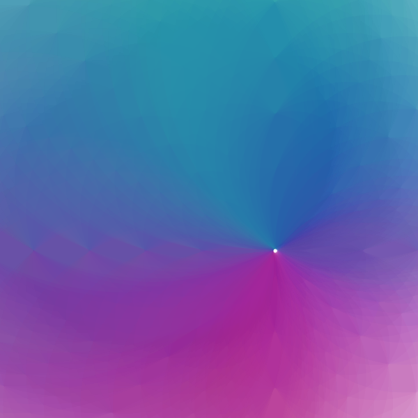

### Circle Move

```go
func main() {
 rand.Seed(time.Now().Unix())
 c := generativeart.NewCanva(1200, 500)
 c.SetBackground(common.White)
 c.FillBackground()
 c.Draw(arts.NewCircleMove(1000))
 c.ToPNG("circlemove.png")
}
```

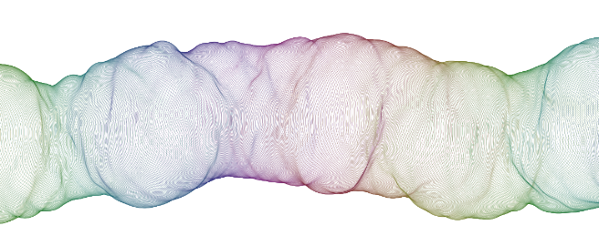

### Random Circle

```go
func main() {
 rand.Seed(time.Now().Unix())
 c := generativeart.NewCanva(500, 500)
 c.SetBackground(common.MistyRose)
 c.SetLineWidth(1.0)
 c.SetLineColor(color.RGBA{
  R: 122,
  G: 122,
  B: 122,
  A: 30,
 })
 c.SetColorSchema(common.Plasma)
 c.SetIterations(4)
 c.FillBackground()
 c.Draw(arts.NewRandCicle(30, 80, 0.2, 2, 10, 30, true))
 c.ToPNG("randcircle.png")
}
```

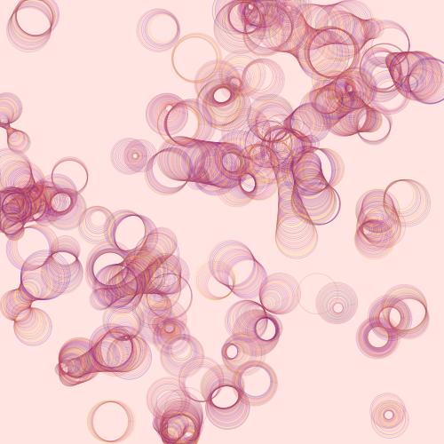

## TODO

- Add more kinds of generative arts or types.

## Contribution

Thanks for the following sites and repos, I got lots of ideas, inspiration, code, and tricks from them. The list would be very long; sorry for forgetting some of them.

- <https://inconvergent.net/>
- <https://fronkonstin.com/>
- <https://github.com/aschinchon/cyclic-cellular-automata>
- <https://github.com/armdz/ProcessingSketchs>
- <https://github.com/Mr-Slesser/Generative-Art-And-Fractals>
- <https://github.com/cdr6934/Generative-Processing-Experiments>
- <https://github.com/pkd2512/inktober2017>
- <http://blog.dragonlab.de/2015/03/generative-art-week-1>
- <https://editor.p5js.org/kenekk1/sketches/Ly-5XYvKX>
- <http://paulbourke.net/fractals/peterdejong/>
- <https://editor.p5js.org/kenekk1/sketches/O44Dln5oo>
- <https://openprocessing.org/sketch/1071233>
- <https://twitter.com/okazz_>
- <https://openprocessing.org/sketch/738638>
- <https://openprocessing.org/sketch/1102157>
- <https://openprocessing.org/sketch/1071233>
- <https://openprocessing.org/user/139364>
- <https://openprocessing.org/sketch/792407>
