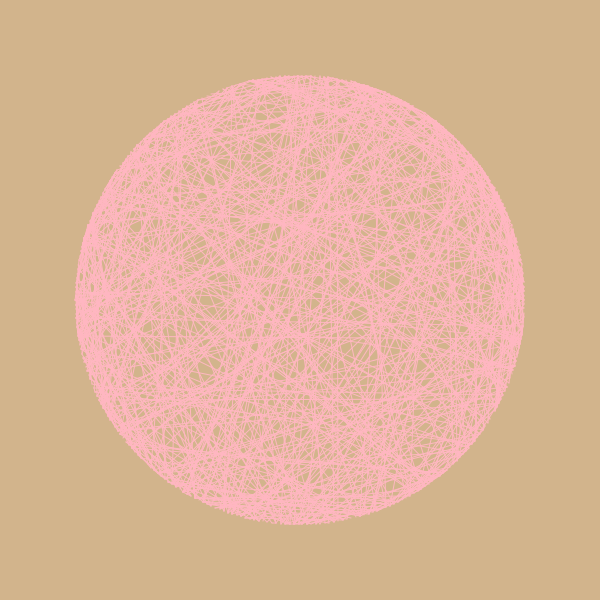

# generativeart

[](https://goreportcard.com/report/github.com/jdxyw/generativeart)
[](https://raw.githubusercontent.com/jdxyw/generativeart/master/LICENSE)


generativeart is a `Go` package to generate many kinds of generative art. The code is collecting some excellent generative art (implemented in `R` or `Processing`), and implement them in `Go` again. Currently, it supports the following type.

- Maze
- Julia Set
- Random Circle Trails
- Silk Smoke
- Spiral Square
- Square Grid
- Circle Line
- Circle Loop
- Silk Sky

For these kinds of art, the package provides as many as parameters to control the appearance. 

## Install

```bash
go get github.com/jdxyw/generativeart
```

## Art Type

```go
NewCircleLine(step float64, lineNum int, radius float64)
NewCircleLoop(radius float64)
NewMaze()
NewRandCicle(mc, msp int, minStep, maxStep, minr, maxr float64, isRandColor bool)
NewSilkSky(circleNum int, sunRadius float64)
NewSilkSmoke(mc, msp int, minStep, maxStep, minRadius, maxRadius float64, isRandColor bool)
NewSpiralSquare(squareNum int, rectSide, decay float64, randColor bool)
```

## Usage and example

### Silk Smoke

```go
func main() {
	rand.Seed(time.Now().Unix())
	c := generativeart.NewCanva(500, 500, 2, 2)
	c.SetBackground(generativeart.Black)
	c.SetLineWidth(1.0)
	c.SetLineColor(generativeart.MediumAquamarine)
	c.SetAlpha(30)
	c.SetColorSchema(generativeart.Plasma)
	c.SetIterations(4)
	c.FillBackground()
	c.Draw(generativeart.NewSilkSmoke(400, 20, 0.2, 2, 10, 30, false))
	c.ToPNG("silksmoke.png")
}
```


### Spiral Square

```go
func main() {
	rand.Seed(time.Now().Unix())
	c := generativeart.NewCanva(500, 500, 2, 2)
	c.SetBackground(generativeart.MistyRose)
	c.SetLineWidth(10)
	c.SetLineColor(generativeart.Orange)
	c.SetColorSchema(generativeart.Viridis)
	c.SetForeground(generativeart.Tomato)
	c.FillBackground()
	c.Draw(generativeart.NewSpiralSquare(40, 400, 0.05, true))
	c.ToPNG("spiralsquare.png")
}
```


### Circle Loop

```go
func main() {
	rand.Seed(time.Now().Unix())
	c := generativeart.NewCanva(500, 500, 2, 2)
	c.SetBackground(generativeart.Black)
	c.SetLineWidth(1)
	c.SetLineColor(generativeart.Orange)
	c.SetAlpha(30)
	c.SetIterations(1000)
	c.FillBackground()
	c.Draw(generativeart.NewCircleLoop(100))
	c.ToPNG("circleloop.png")
}
```


### Julia Set

```go
func julia1(z complex128) complex128 {
	c := complex(-0.1, 0.651)

	z = z*z + c

	return z
}

func main() {
	rand.Seed(time.Now().Unix())
	c := generativeart.NewCanva(500, 500, 1.5, 1.5)
	c.SetIterations(800)
	c.SetColorSchema(generativeart.Viridis)
	c.FillBackground()
	c.Draw(generativeart.NewJulia(julia1, 40))
	c.ToPNG("julia.png")
}
```


### Circle Line

```go
func main() {
	rand.Seed(time.Now().Unix())
	c := generativeart.NewCanva(600, 600, 2, 2)
	c.SetBackground(generativeart.Tan)
	c.SetLineWidth(1.0)
	c.SetLineColor(generativeart.LightPink)
	c.FillBackground()
	c.Draw(generativeart.NewCircleLine(0.02, 600, 1.5))
	c.ToPNG("circleline.png")
}
```



### Silk Sky

```go
func main() {
	rand.Seed(time.Now().Unix())
	c := generativeart.NewCanva(600, 600, 1, 1)
	c.SetAlpha(10)
	c.Draw(generativeart.NewSilkSky(15, 5))
	c.ToPNG("silksky.png")
}
```


### Maze

```go
func main() {
	rand.Seed(time.Now().Unix())
	c := generativeart.NewCanva(600, 600, 2, 2)
	c.SetBackground(generativeart.Azure)
	c.SetLineWidth(3)
	c.SetLineColor(generativeart.Orange)
	c.FillBackground()
	c.Draw(generativeart.NewMaze())
	c.ToPNG("maze.png")
}
```


### Random Circle

```go
func main() {
	rand.Seed(time.Now().Unix())
	c := generativeart.NewCanva(500, 500, 2, 2)
	c.SetBackground(generativeart.MistyRose)
	c.SetLineWidth(1.0)
	c.SetLineColor(color.RGBA{
		R: 122,
		G: 122,
		B: 122,
		A: 30,
	})
	c.SetColorSchema(generativeart.Plasma)
	c.SetIterations(4)
	c.FillBackground()
	c.Draw(generativeart.NewRandCicle(30, 80, 0.2, 2, 10, 30, true))
	c.ToPNG("randcircle.png")
}
```


## TODO

- Add more kinds of generative arts or types.

## Contribution

Thanks for the following sites and repos, I got lots of ideas, inspiration, code and tricks from them. The list would be very long, sorry for forgetting some of them.

- https://inconvergent.net/
- https://fronkonstin.com/
- https://github.com/aschinchon/cyclic-cellular-automata
- https://github.com/armdz/ProcessingSketchs
- https://github.com/Mr-Slesser/Generative-Art-And-Fractals
- https://github.com/cdr6934/Generative-Processing-Experiments
- https://github.com/pkd2512/inktober2017
- http://blog.dragonlab.de/2015/03/generative-art-week-1
