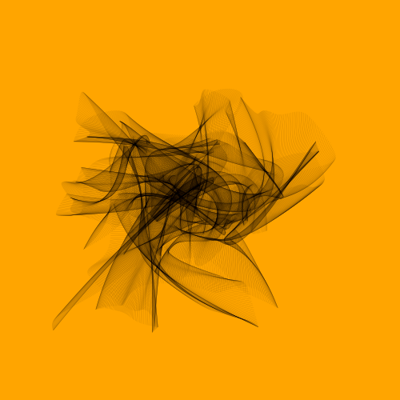
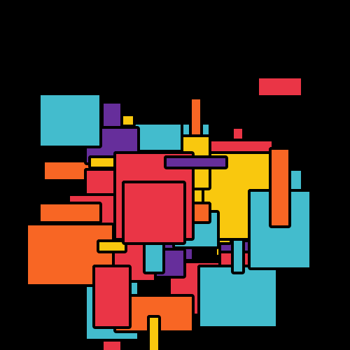
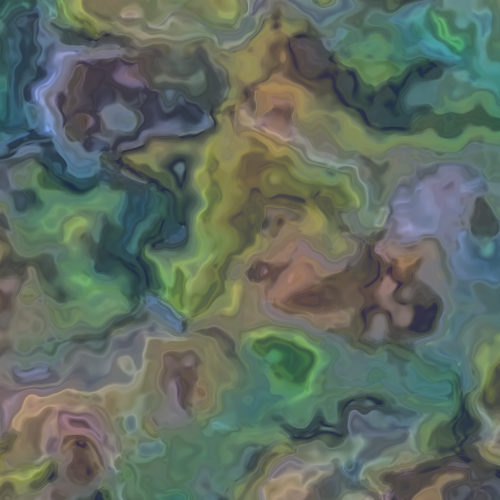
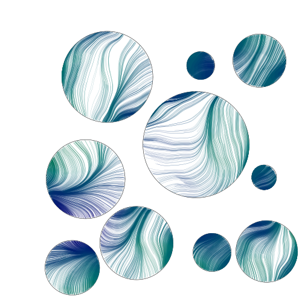

# Table of Contents

- [Table of Contents](#table-of-contents)
	- [Color Circle 2](#color-circle-2)
		- [parameters](#parameters)
	- [Dot Line](#dot-line)
		- [parameters](#parameters-1)
	- [Random Shape](#random-shape)
		- [parameters](#parameters-2)
	- [Janus](#janus)
		- [TODO](#todo)
		- [parameters](#parameters-3)
	- [Contour Line](#contour-line)
		- [parameters](#parameters-4)
	- [Silk Sky](#silk-sky)
		- [parameters](#parameters-5)
	- [Julia](#julia)
		- [parameters](#parameters-6)
	- [Noise Line](#noise-line)
		- [parameters](#parameters-7)
	- [Ocean Fish](#ocean-fish)
		- [parameters](#parameters-8)
	- [Circle Loop2](#circle-loop2)
		- [parameters](#parameters-9)
	- [Pixel Hole](#pixel-hole)
		- [parameters](#parameters-10)
	- [Dots Wave](#dots-wave)
		- [parameters](#parameters-11)
	- [Circle Move](#circle-move)
		- [parameters](#parameters-12)
	- [Circle Noise](#circle-noise)
		- [parameters](#parameters-13)
	- [Yarn](#yarn)
		- [parameters](#parameters-14)
	- [Black Hole](#black-hole)
		- [parameters](#parameters-15)
	- [Color Canva](#color-canva)
		- [parameters](#parameters-16)
	- [Domain Warping](#domain-warping)
		- [parameters](#parameters-17)
	- [Perlin Perls](#perlin-perls)
		- [parameters](#parameters-18)

## Color Circle 2

`Color Circle2` is version 2 of `Color Circle`. It still draws the circle and point cloud.

### parameters

- circleNum: The number of the circle in this drawing.

```go
cc := arts.NewColorCircle2(30)
```


## Dot Line

`dot line` would draw images with the short dot and short. The short lines would compose as a big circle.

### parameters

- n: The number of elements in this image.
- ras/canv: Control the appearance of this image.
- randColor: Use the specified color or random colors.

```go
dl := arts.NewDotLine(100, 20, 50, false)
```


## Random Shape

`random shape` would draw images with random shapes. The whole image would rotate with some degree.

### parameters

- shapeNum: It indicates how many shapes you want to draw.

```go
rs := NewRandomShape(150)
```


## Janus

`Janus` would draw an image with multiple circles split at its center with random noise in the horizontal direction.

### TODO

### parameters

## Contour Line

`Contour Line` uses the `perlin noise` to do some flow field.

### parameters

- lineNum: It indicates how many lines.


## Silk Sky

`Silk Sky` would draw an image with multiple circles converge to one point or one circle.

### parameters

- circleNum: The number of the circles in this drawing.
- sunRadius: The radius of the sun. The sun is a point/circle where other circles meet.

```go
silkSky := NewSilkSky(circleNum int, sunRadius float64)
```


## Julia

`Julia` is to draw a `Julia Set`. [Julia Set](https://en.wikipedia.org/wiki/Julia_set) is a math concept. You can define your own formula in this package.

### parameters

- fn: The custom julia set function.
- maxz: The maximum modulus length of a complex number.
- xaixs, yaixs: The range for the X-Y coordination used to mapping the julia set number to the real pixel of the image. These should be positive. It only indicates the first quadrant range.

```go
func julia1(z complex128) complex128 {
 c := complex(-0.1, 0.651)
 z = z*z + c
 return z
}
julia := arts.NewJulia(julia1, 40, 1.5, 1.5)
```


## Noise Line

`Noise Line` draws some random line and circles based on `perlin noise`.

### parameters

- n: The number of random line.

```go
nl := arts.NewNoiseLine(1000)
```


## Ocean Fish

`Ocean Fish` draws an ocean and some fishes in the center.

### parameters

- lineNum: The number of the line used to simulate the ocean wave.
- fishNum: The number of fish.

```go
o := arts.NewOceanFish(100, 8)
```


## Circle Loop2

`Circle loop2` draws a circle composed by colored circles.

### parameters

- depth: Control the number of circles.

```go
cl := arts.NewCircleLoop2(7)
```


## Pixel Hole

`Pixel Hole` draws a hole with colored dots.

### parameters

- dotN: The number of point in each iteration.

```go
ph := arts.NewPixelHole(60)
```


## Dots Wave

### parameters

- dotsN: The number of dots wave in the image.

```go
d := arts.NewDotsWave(300)
```


## Circle Move

### parameters

- circleNum: The number of the circle in the image.

```go
cm := arts.NewCircleMove(1000)
```


## Circle Noise

### parameters

- dotsN: The number of dot.
- colorMin: The minimum color.
- colorMax: The maximum color.


## Yarn

### parameters

- n: The number of the curve.

```go
y := arts.NewYarn(2000)
```



## Black Hole

### parameters

- circleN: The number of the circle.
- density: Control the density of the circle.
- circleGap: Identify the gap between two circles.

```go
b := arts.NewBlackHole(200, 400, 0.01)
```


## Color Canva

### parameters

- seg:

```go
cc := arts.NewColorCanve(5)
```



## Domain Warping

Warping, or domain distortion is a very common technique in computer graphics for generating procedural textures and geometry. It's often used to pinch an object, stretch it, twist it, bend it, make it thicker or apply any deformation you want.

### parameters

- scale: Control the noise generator.
- xOffset: Control the noise generator.
- yOffset: Control the noise generator.
- fn: A function to mapping the `noise` to color.

```go
d := arts.NewDomainWrap(0.01, 4, 8, cmap)
```



## Perlin Perls

### parameters

- circleN: The number of circle on this image.
- dotsN: The number of dots in each circle. 
- colorMin: The minimum color.
- colorMax: The maximum color.

```go
pp := arts.NewPerlinPerls(10, 200, 40, 80
```

